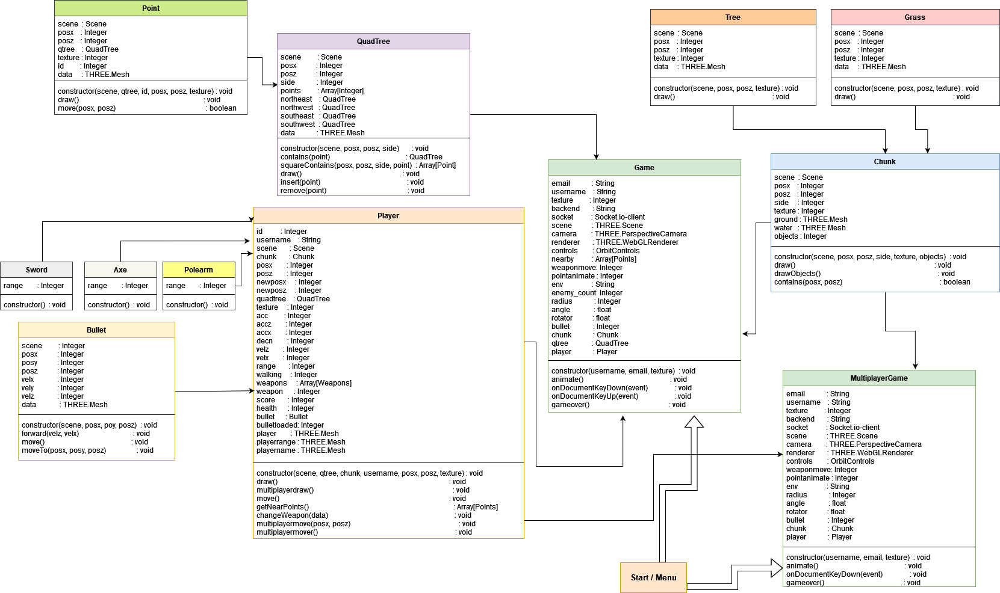
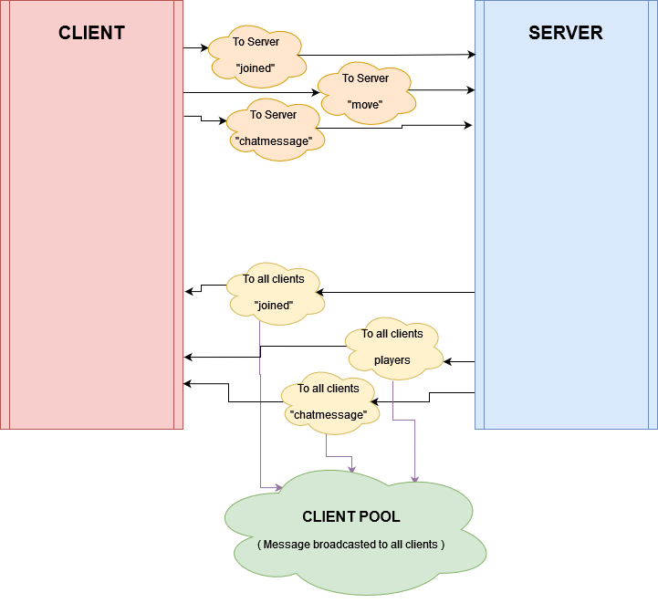
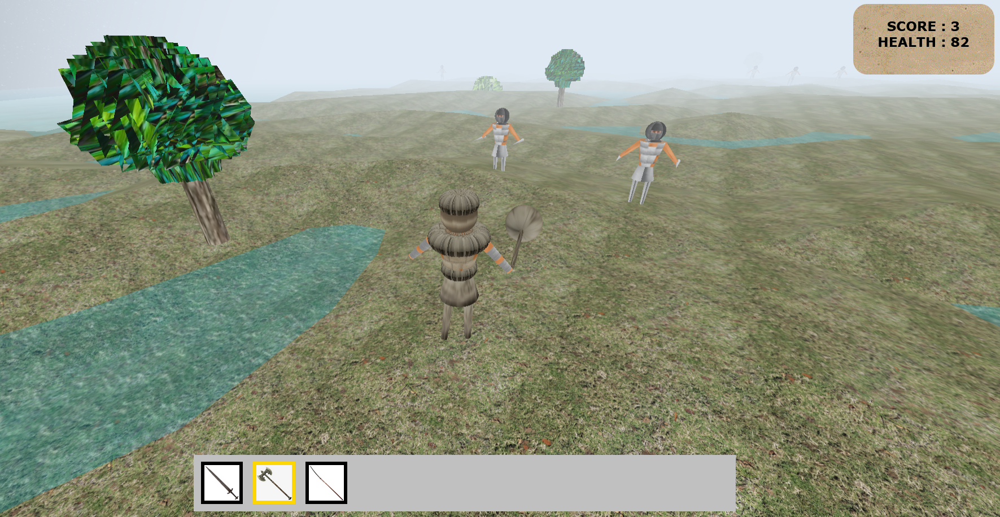
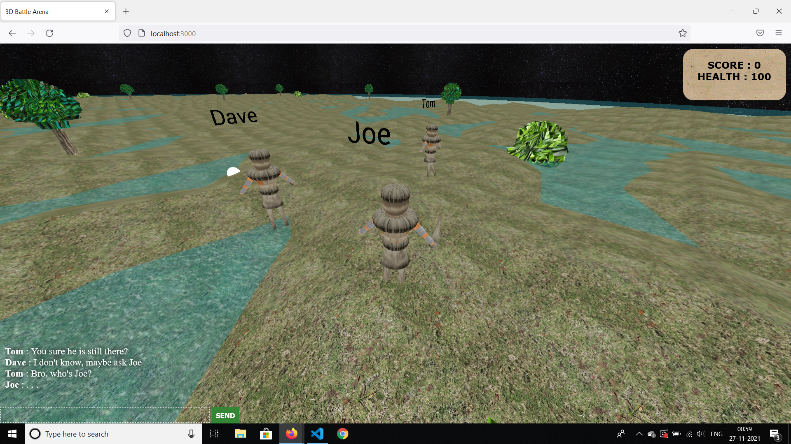

    
About this project

 A 3D Third Person Perspective game developed using javascript.
  Three.js library used for 3D rendering of objects, characters and NPCs.
  Socket.io used to obtain synchronzation among clients in multiplayer mode.
  Gamemodes:
<ul>
    <li>Singleplayer  : Destroy endless spawning bots until you run out of health.</li>
    <li>Multiplayer   : Compete with real players in a free for all battle .</li>
</ul>
   

# Client Structure:

  
  

# Server Structure:

  
  

# Screenshots:

## Singleplayer

  
  

## Multiplayer

